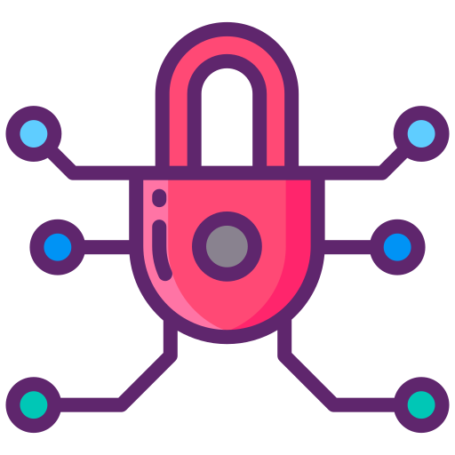

# **Brutencrypt**

<!--markdownlint-disable MD033-->

## **Looooong introduction**

After stumbling upon [Computerphile's video about the buffer overflow attack](https://youtu.be/1S0aBV-Waeo), my interest in cybersecurity and reverse engineering was piqued. I delved into understanding the intricacies of these fields, fascinated by the ways vulnerabilities could be exploited and systems could be reverse-engineered for analysis and improvement.

Exploring cybersecurity not only allowed me to comprehend the importance of safeguarding systems but also revealed the complexity of identifying and mitigating potential threats. With each newfound concept, I realized the critical need for continuous learning and adaptation in this rapidly evolving landscape.

Additionally, the world of reverse engineering opened up a realm of fascination. Unraveling the inner workings of software and hardware to understand their functionalities, and sometimes discovering ingenious solutions hidden within, became an absorbing challenge. This process of dissecting and reconstructing technology provided insights into innovation and allowed me to appreciate the artistry behind the design of intricate systems.

Exploring password security led me to explore encryption algorithms, hashing techniques, and secure storage protocols. I delved into the mechanisms of brute-force attacks, dictionary attacks, and rainbow tables, understanding the importance of strong, unique passwords. Alongside this, I ventured into password generation techniques, exploring randomization algorithms and passphrase strategies. The significance of salting, key stretching, and using secure hashing algorithms like bcrypt or SHA-256 became evident in safeguarding stored passwords.

Furthermore, I delved into the realm of secure password storage, exploring techniques like key derivation functions and secure password managers. Understanding the balance between usability and security in password management systems became a key aspect of my research. Overall, this journey into password security was a multifaceted exploration, uncovering the nuances of protection and resilience in an ever-evolving cybersecurity landscape.

If you've come so far and are still reading this, I just wanted to let you know that everything you just read was AI-generated. 🤡

## **Password Generation**

### **Entropy**

## **Password Storage**

### **Hashing**

### **Salting**
